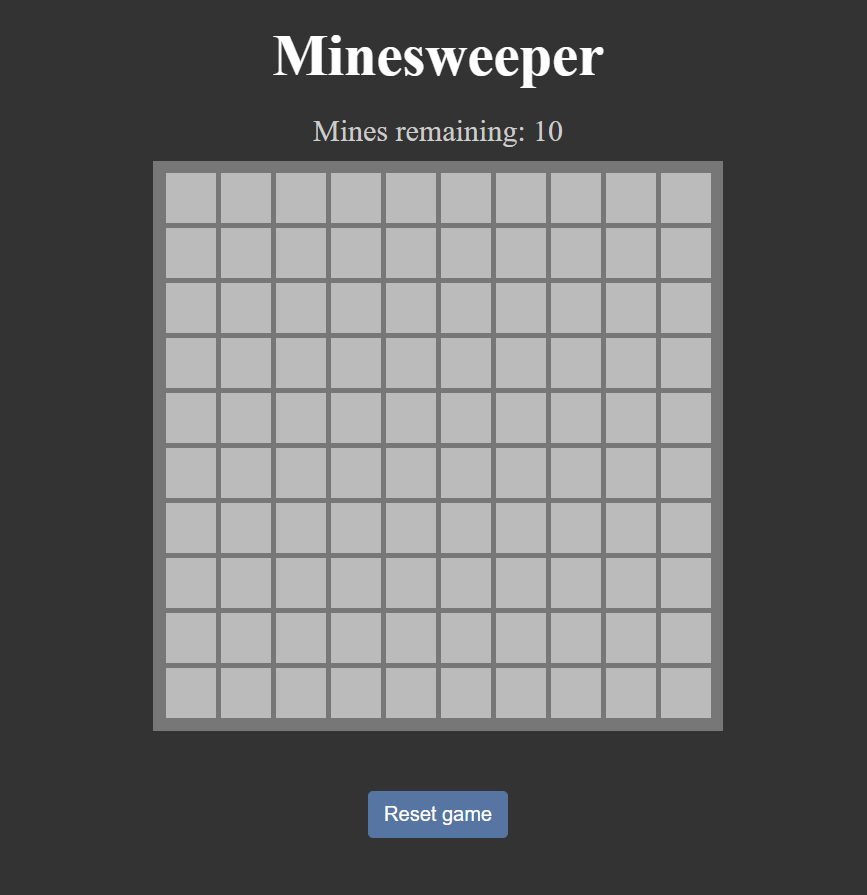
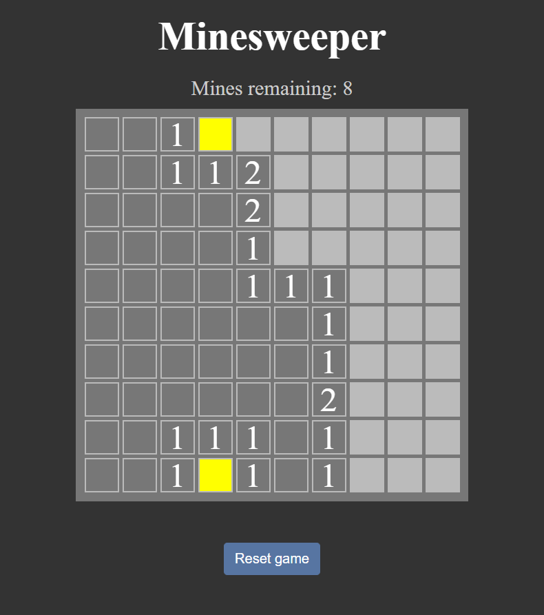
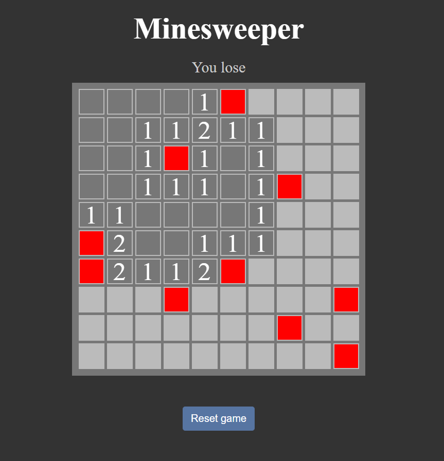

<p>
  <h2 align="center">Minesweeper</h2>
</p>

A rendition of the classic Minesweeper game. The aim of the game is to clear out the board and not hit any mines in the process.

The project uses a basic server built in express to access the webpage. A server was used as the project contains a JS module and access to it is blocked by the browsers CORS policy. This layout layout also makes sense if you wanted to serve this page on other servers.

## 📝 Table of Contents

- [📝 Table of Contents](#-table-of-contents)
- [🖼️ Project Images <a name = "project_images"></a>](#-project-images-)
- [🚀 Future Scope <a name = "future_scope"></a>](#-future-scope-)
- [🏁 Getting Started <a name = "getting_started"></a>](#-getting-started-)
  - [Prerequisites <a name = "prerequisites"></a>](#prerequisites-)
  - [Running the project <a name = "running"></a>](#running-the-project-)
- [⛏️ Built With <a name = "tech_stack"></a>](#️-built-with-)
- [✍️ Authors <a name = "author"></a>](#️-author-)

## 🖼️ Project Images <a name = "project_images"></a>

<p align="center">
  
</p>

<details>
<summary>See More Images</summary>
<br/>
<p align="center">
  
  
</p>
</details>

## 🚀 Future Scope <a name = "future_scope"></a>

I may decide to add some of the following features in the future:
- 🔲Variable board size
- 🎨Page color schemes
- 💪Difficulty levels

## 🏁 Getting Started <a name = "getting_started"></a>

These instructions will get you a copy of the project up and running on your local machine for development and testing purposes.

### Prerequisites <a name = "prerequisites"></a>

To be able to run the website, first you need to install the required modules with:

```
npm install 
```

### Running the project <a name = "running"></a>

To run the website you need to run the server using node:

```
node server.js
```
Then navigate to the website in the browser. Type the following url into the browser:

```
http://localhost:3000/
```
If you type anything at the end of this url you will be redirected to the website by the server

## ⛏️ Built With <a name = "tech_stack"></a>

- [JavaScript](https://python.org/) - Language
- [NodeJS](https://nodejs.org/en/) - JS runtime envoronment
- [ExpressJS](https://expressjs.com/) - Server
- [EJS](https://ejs.co/) - Javascript templating engine
- [Bootstrap](https://getbootstrap.com/) - Button css classes used in styles.css

## ✍️ Author <a name = "author"></a>

- [JakubRichardson](https://github.com/JakubRichardson) 
